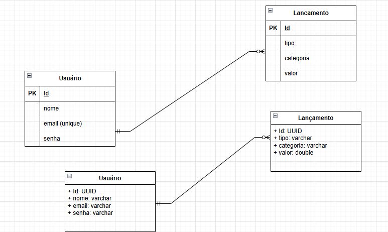

# API Finanças

## Objetivo:

Seguindo as diretrizes do padrão Rest, vamos construir uma api onde o usuário vai poder gerenciar suas finanças. Adicionando seus gasto e despesas e identificando o caminho que seu dinheiro está percorrendo.

## OverView

O Sistema deve permitir o cadastro de um usuário com os seguintes campos:

1. nome (obrigatório)
2. e-mail (obrigatório)
3. senha (obrigatório)
- o usuário deve ser autenticado a cada nova requisição
- deve existir uma funcionalidade para recuperar os dados do usuário como: senha

## Status
<h4> 
	🚧  Em construção...  🚧
</h4>

## Diagrama

